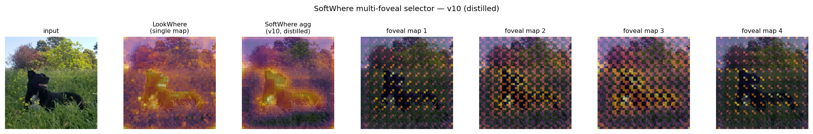

# SoftWhere

SoftWhere is a research prototype for replacing LookWhere's hard single-map
selector with a sampling-free, multi-foveal TokenLearner selector. The current
proposal and results are summarized in `SoftWhere_Proposal.pdf`.

The latest diagnostic result is positive but still scoped: TokenLearner-SR plus
mini end-to-end classifier-signal training improves ADE20K small-object coverage
over the LookWhere single-map baseline across the tested patch budgets. The next
research step is downstream kNN classification and segmentation, not more local
coverage tuning.

## Repository Layout

```text
softwhere/
  SoftWhere_Proposal.pdf          # current proposal writeup
  Makefile                        # experiment entrypoints
  run_exp*.sh                     # one wrapper per experiment
  experiment_env.sh               # shared runner/logging helper
  requirements.txt                # pinned shared environment
  lookwhere/                      # LookWhere fork + SoftWhere experiment code
  Open-TokenLearner/              # TokenLearner fork
  personal/results/               # curated experiment notes and interpretations
```

## Setup

Create or reuse the shared Python environment from `requirements.txt`:

```bash
cd softwhere
uv venv --python=3.12 .venv
uv pip install --no-deps --python .venv/bin/python -r requirements.txt
```

The experiment wrappers default to:

```text
PY=./.venv/bin/python
CUDA_VISIBLE_DEVICES=0
OTL_PATH=./Open-TokenLearner
```

Override any of these when invoking `make`, for example:

```bash
make exp6 CUDA_VISIBLE_DEVICES=0 STEPS=500
```

The LookWhere checkpoint, Imagenette, and ADE20K data should already be present
if you ran `make prepare`. Run `make prepare` to clone/update the repos,
install the uv environment, and prepare the checkpoint/data without launching an
experiment.

## Current Experiment Workflow

Use the Makefile from the top-level `softwhere` directory:

```bash
make help
make exp1
make exp2
make all
```

Targets:

| Target | Script | Purpose |
|---|---|---|
| `make prepare` | `experiment_env.sh prepare` | Clone/update repos, install the shared uv environment, and prepare checkpoint/data. |
| `make exp1` | `run_exp1_resolution_parity.sh` | Train/evaluate TokenLearner-SR with `diversity=1`; creates `softwhere_head_v10_sr_div1.pt`. |
| `make exp2` | `run_exp2_selection_policy_ablation.sh` | Compare aggregate, per-map top-k, per-map NMS, distance penalty, random, and LookWhere. |
| `make exp3` | `run_exp3_nms_robustness_div1.sh` | Sweep NMS distance and patch budget for the `div1` head. |
| `make exp4` | `run_exp4_diversity_and_s_sweeps.sh` | Sweep diversity weights and fovea count `S`; identifies `div0/S=4` as the main distilled setting. |
| `make exp5` | `run_exp5_main_div0_sanity_check.sh` | Check teacher agreement, visualization, and focused NMS coverage for `div0`. |
| `make exp6` | `run_exp6_mini_e2e_cls.sh` | Run mini end-to-end CLS-signal training from the `div0` head. |
| `make exp7` | `run_exp7_e2e_head_sanity_check.sh` | Sanity-check the mini E2E CLS head. |
| `make coverage` | experiments 1-5 | Run the coverage-focused distilled-head workflow. |
| `make e2e` | experiments 6-7 | Run and check the mini E2E workflow; requires the `div0` head from exp4. |
| `make all` | experiments 1-7 | Run the full current diagnostic sequence. |

Each script writes a timestamped console log to:

```text
personal/logs/
```

The scripts intentionally fail early if a required head is missing. For example,
`exp2` requires `lookwhere/softwhere_head_v10_sr_div1.pt`, and `exp6` requires
`lookwhere/softwhere_head_v10_sr_div0.pt`.

To let an experiment script run preparation first, use:

```bash
SOFTWHERE_AUTO_PREPARE=1 make exp1
```

## Important Artifacts

Current key heads:

```text
lookwhere/softwhere_head_v10_sr_div1.pt
lookwhere/softwhere_head_v10_sr_div0.pt
lookwhere/softwhere_head_v10_sr_div0_mini_e2e_cls.pt
```

Current key CSVs:

```text
lookwhere/softwhere_nms_robustness_div1.csv
lookwhere/softwhere_nms_robustness_diversity.csv
lookwhere/softwhere_nms_robustness_S.csv
lookwhere/softwhere_nms_robustness_main_div0.csv
lookwhere/softwhere_nms_robustness_div0_vs_e2e_cls.csv
lookwhere/softwhere_nms_robustness_div0_vs_e2e_cls_sanity.csv
```

Current visualization:



## Current Headline Results

The curated notes live in [wiki](https://github.com/engichang1467/softwhere/wiki). The short version:

- Resolution parity matters: TokenLearner-SR fixes the earlier low-resolution
  coverage failure.
- Selection policy matters: aggregating foveal maps loses the coverage signal,
  while per-map NMS turns the maps into a positive coverage result.
- The best distilled setting is `v10 / TokenLearner-SR conv / S=4 /
  diversity=0 / per_map_nms / nms_dist=2`.
- Mini end-to-end CLS training improves the distilled head and becomes the
  current main coverage result.

Focused NMS coverage for the mini E2E CLS head:

| k | LookWhere | Distilled `div0` | Mini E2E CLS | Margin vs. LookWhere |
|---:|---:|---:|---:|---:|
| 16 | 0.2622 | 0.2591 | 0.2844 | +0.0221 |
| 72 | 0.5691 | 0.6077 | 0.6413 | +0.0723 |
| 128 | 0.6921 | 0.7495 | 0.7664 | +0.0743 |
| 136 | 0.7012 | 0.7605 | 0.7819 | +0.0807 |

Sanity-check metrics for the mini E2E CLS head:

| Metric | Value |
|---|---:|
| Teacher top-k recall | 0.571 |
| Teacher top-k IoU | 0.404 |
| Random top-k recall | 0.099 |
| Map overlap | 0.425 |
| Plain multi-foveal recall at `k=136` | 0.712 |

These are object-coverage diagnostics, not final LookWhere-comparable kNN
classification or segmentation numbers.